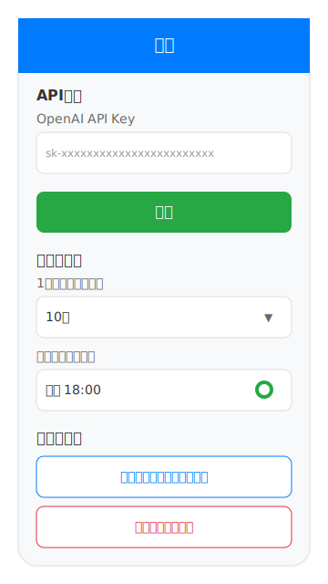

# 受験対策アプリ - 画面一覧

このドキュメントでは、受験対策アプリの各画面のデザインと機能を説明します。

## 1. ホーム画面

### 機能

- **ウェルカムメッセージ**: ユーザーへの挨拶
- **メインメニュー**:
  - 問題を解く: ランダム10問に挑戦
  - 問題を作成: AIで新しい問題を生成
  - 結果を見る: 過去の成績と履歴を確認
  - 設定: API設定とその他の設定
- **学習統計**: 今週の学習状況
  - 解いた問題数
  - 平均正答率
  - 連続学習日数
  - 学習時間
- **クイックアクション**: 間違えた問題を復習する機能

## 2. 問題作成画面

### 機能

- **試験名入力**: 対象試験の指定
- **キーワード入力**: 問題生成のためのキーワード設定
- **AI問題作成**: 入力内容に基づく自動問題生成
- **作成済み問題管理**:
  - 問題一覧表示
  - 問題の編集・削除機能
  - 問題詳細（選択肢数、単一/複数選択の表示）
- **手動問題追加**: 手動での問題作成機能

## 3. 問題画面

### 機能

- **進捗表示**: 現在の問題番号と全体の進捗バー
- **試験名表示**: 実施中の試験名
- **問題文エリア**: 問題内容と選択肢の表示
- **選択機能**:
  - 単一選択・複数選択対応
  - 選択状態の視覚的フィードバック
- **ナビゲーション**:
  - 前の問題/次の問題ボタン
  - 問題一覧表示機能
- **時間表示**: 残り時間の表示
- **テスト終了**: テストの途中終了機能

## 4. 結果画面

### 機能

- **正答率表示**: 視覚的な円グラフと詳細スコア
- **試験情報**: 試験名と問題数の表示
- **問題一覧**:
  - 正解/不正解の色分け表示
  - 問題詳細のアコーディオン表示
  - 選択肢と正解の比較
  - 解説の表示
- **アクション機能**:
  - 全問再挑戦
  - 間違いのみ復習
  - ホームに戻る

## 5. 履歴画面

### 機能

- **試験選択**: 試験別の履歴表示切り替え
- **過去の結果一覧**:
  - 日付、正答率、問題数の表示
  - 結果の色分け（成績による）
  - 詳細結果のアコーディオン表示
- **問題詳細**:
  - 個別問題の正解/不正解
  - 選択した答えと正解の比較
- **統計情報**:
  - 平均正答率
  - 受験回数
  - 最高得点・最低得点
- **データ管理**:
  - 期間での絞り込み
  - CSVエクスポート機能

## 6. 設定画面

### 機能

- **API設定**:
  - OpenAI API Keyの設定と保存
- **アプリ設定**:
  - 1回あたりの問題数設定
  - 学習リマインダーの設定（時間指定とON/OFF）
- **データ管理**:
  - 学習データのエクスポート
  - 全データのクリア機能

## 共通要素

### デザインシステム

- **カラーパレット**:
  - プライマリ: #007bff（青）
  - セカンダリ: #28a745（緑）
  - 警告: #dc3545（赤）
  - 情報: #17a2b8（水色）
  - その他: #6c757d（グレー）、#6f42c1（紫）
- **レイアウト**: 360×640pxのモバイル画面想定
- **コンポーネント**: 角丸ボタン、カード形式の情報表示

### ナビゲーション

各画面間の遷移は直感的で、戻るボタンやホームボタンが適切に配置されています。

### ユーザビリティ

- アクセシビリティを考慮した色の使い分け
- 明確な視覚的フィードバック
- 段階的な情報開示（アコーディオン等）
